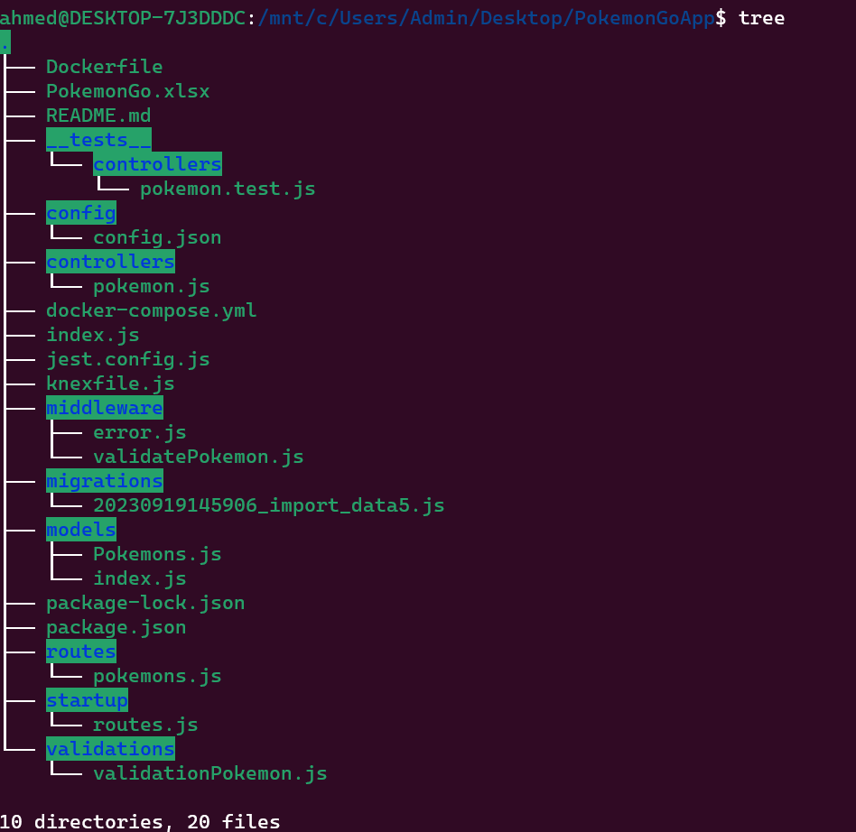

# PokemonGoApp

## technologies

    - Nodejs
    - Postgresql
    - Jest
    - Docker
    - Knexjs
    - exceljs

## code structur

## code setup and run

1.  clone the github repo `git clone git@github.com:Ahmed-Alanaswah/PokemonGoApp.git`
2.  npm i
3.  replcae config.json and kenxfile.js with your own configeration
4.  write these commands to run code and migrate data

    - `docker-compose up ` to run code on docker
    - `docker ps` to see your containers
    - `docker exec -it <container_id_or_name> /bin/bash` to go throw container bash
    - `cd app` then `ls` to go through app and you will see migrations folder
    - `npx knex migrate:make migration_name ` to create migration file if it is not found but it is found so do not need it
    - `npx knex migrate:latest` to run migrations file
